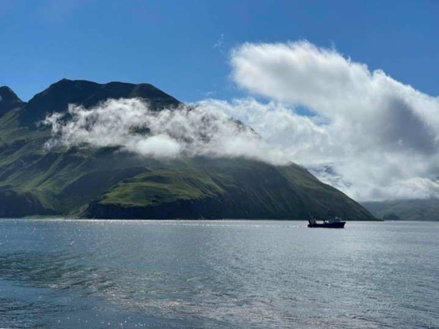

```{r setup, include=FALSE}
knitr::opts_chunk$set(echo = FALSE)
```


:::: {style="display: flex;"}

::: {}
The RACE Survey App is a comprehensive resource for all scientific personnel to use during the RACE bottom trawl surveys. The goal is for the Survey App to contain all information, manuals, forms, or other resources that could possibly ever be needed during the surveys.

<span style="color: red;">**IN CASE OF EMERGENCY:**</span> Find the `r site$title_link_inline[grepl(x = site$title, pattern = "EMERGENCY Flow Chart")] ` and [resource pages](.././docs/safety_illness_and_injury_reporting.html) here. 

**If you are unable to see the navigation bar at the top of the page,** please maximize your browser window and/or resize the Survey App (using `Ctrl +` and `Ctrl -`) until you are able to see the menu.
:::

::: {}
```{r, layout="l-body-outset"}

```
:::

::::


