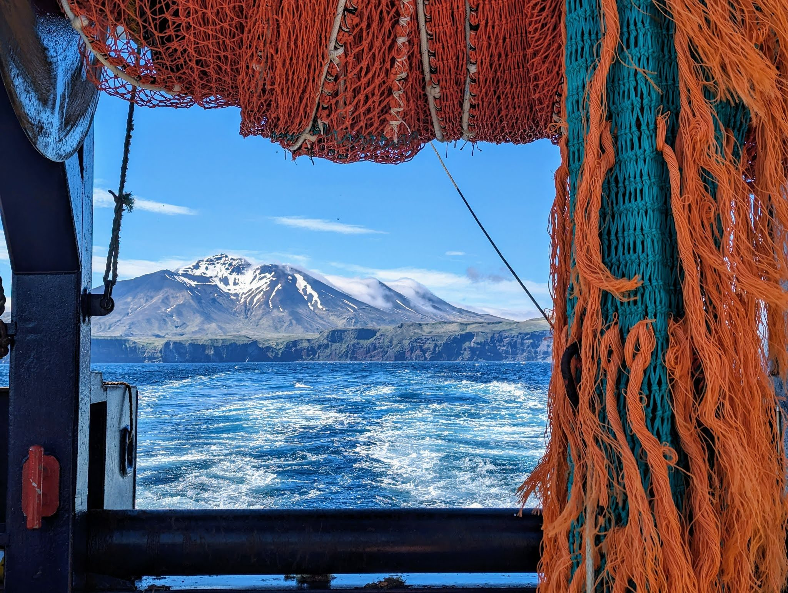

```{r setup, include=FALSE}
knitr::opts_chunk$set(echo = FALSE)
```

<style>
.hero-container {
  display: flex;
  flex-wrap: nowrap;
  gap: 1.5rem;
  align-items: stretch;
}

/* TEXT COLUMN */
.hero-text {
  flex: 1 1 520px;
  min-width: 0;
  background: #f8fafc;
  padding: 2rem;
  border-radius: 16px;
  box-shadow: 0 4px 14px rgba(0,0,0,0.08);
}

/* IMAGE COLUMN */
.hero-image {
  flex: 1 1 380px;
  min-width: 300px;
}

.hero-image img {
  width: 100%;
  height: auto;
  display: block;
  border-radius: 16px;
  box-shadow: 0 6px 18px rgba(0,0,0,0.15);
}

/* HEADLINE */
.hero-text h2 {
  margin-top: 0;
  margin-bottom: 0.75rem;
  color: #003b5c;
  font-size: 2rem;
}

/* BULLETS */
.hero-text ul {
  margin-top: 0.4rem;
  margin-bottom: 0.6rem;
  padding-left: 3rem;
}

.hero-text li {
  margin-bottom: 0.15rem;
}

<!-- .hero-fullbleed { -->
<!--   width: 70vw; -->
<!--   margin-left: calc(-40vw + 50%); -->
<!--   padding: 2rem; -->
<!-- } -->

/* ALERT */
.alert-box {
  background: #fff4f4;
  border-left: 5px solid #d62828;
  padding: 1rem 1.25rem;
  margin: 1.5rem 0;
  border-radius: 10px;
  text-align: center;
  box-shadow: 0 4px 14px rgba(0,0,0,0.08);
}

/* TIP */
.tip-box {
  background: #f1f5f9;
  padding: 1rem 1.25rem;
  border-radius: 10px;
  margin-top: 1rem;
  font-size: 0.95rem;
}

</style>

<div class="hero-fullbleed">
<div class="hero-container">
  <div class="hero-text">

## Welcome aboard

The **RACE Survey App** is a centralized resource for scientific personnel participating in RACE bottom trawl surveys.

Use this app to quickly access:

- manuals and reference materials
- field protocols
- forms and documentation
- software and drivers
- safety resources
- species identification tools

The goal is simple: provide one place for everything you might need during survey operations.

<div class="alert-box">

<span style="color:#d62828;"> **Emergency Resources** </span>

In case of emergency, access the  
`r stringr::str_replace(
  website_content$title_link_inline[
    grepl(website_content$title, pattern = "Emergency Flow Chart", ignore.case = TRUE)
  ],
  "../../",
  ".././"
)`

You can also find additional [illness & injury reporting resources](.././docs/Safety_&_Health_Illness_&_Injury_Reporting.html).

</div>

<div class="tip-box">

**Navigation tip:**  
If the navigation bar is not visible, maximize your browser window or adjust zoom using **Ctrl +** / **Ctrl -** until the full menu appears.

</div>

</div>

<!-- <div class="hero-image"> -->

<!-- ```{r, out.width="100%"} -->
<!--  -->
<!-- ``` -->
<!-- </div>  -->
</div>
</div>